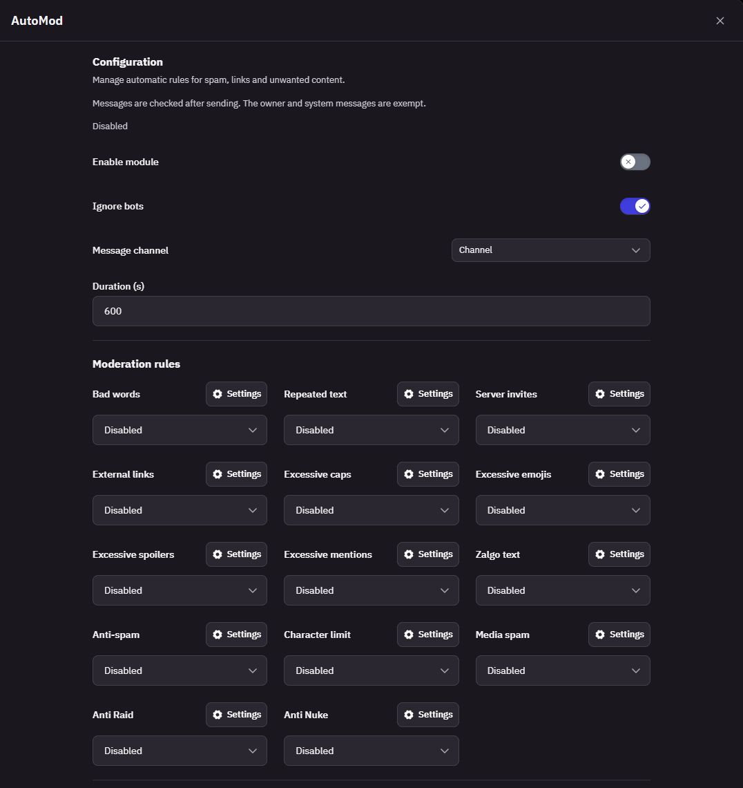
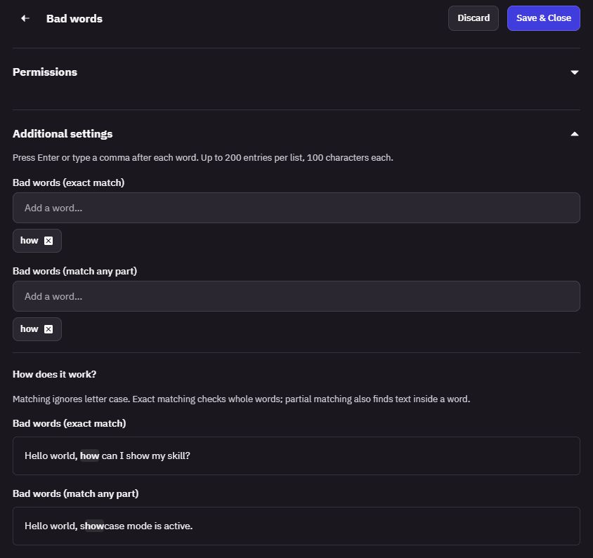
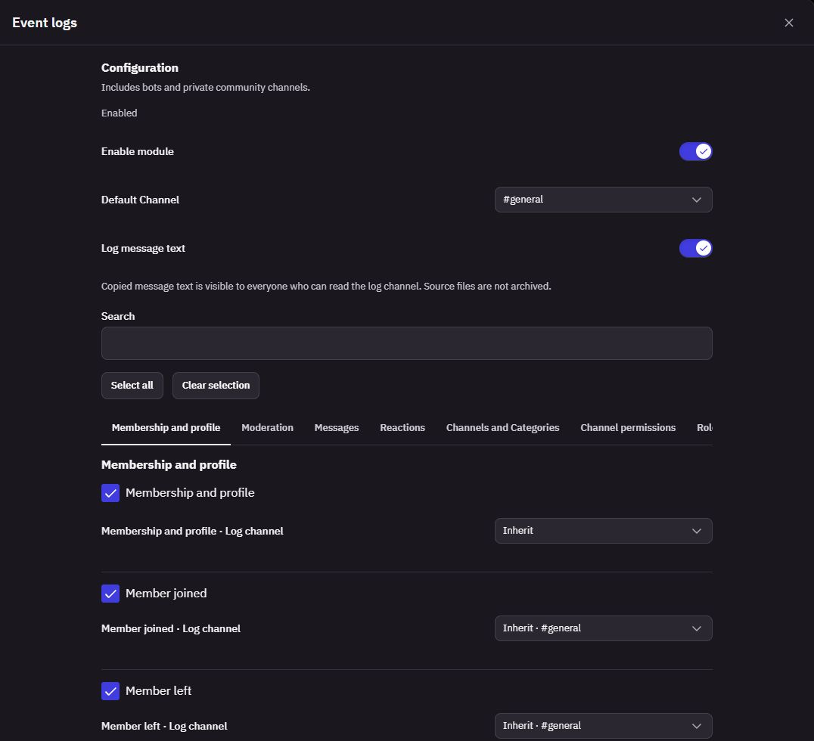
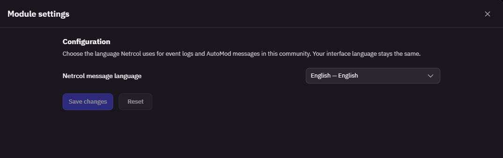
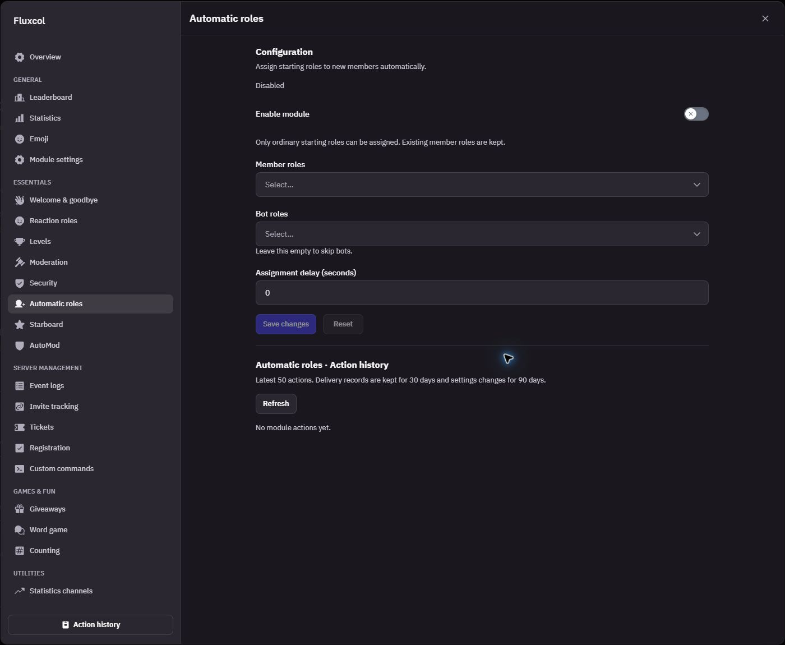

# Fluxcol

**Community moderation and activity tracking, built into Fluxer.**

Fluxcol is a self-hosted community platform built on [Fluxer](https://github.com/fluxerapp/fluxer). It brings AutoMod, event logging, automatic roles, and their configuration into the chat application, so community owners can manage these tools in one place without hosting separate moderation bots or switching between dashboards.

The aim is to keep Fluxer's familiar interface while making day-to-day community management easier: configure rules, choose where activity is logged, and review what the system has done from the same community settings panel.

## What works in this version

- **AutoMod with 14 rules:** bad words, repeated text, server invites, external links, excessive caps, emojis, spoilers and mentions, Zalgo, anti-spam, character limits, media spam, Anti Raid, and Anti Nuke.
- **Configurable moderation:** warnings, message deletion, timeouts, and temporary lockdowns, with shared or per-rule user, role, channel, and category scopes. Rules start disabled.
- **Automatic starting roles:** assign separate role lists to new members and bots, with a configurable delay, durable retries, and action history. Existing roles are preserved; privileged roles are excluded. The module starts disabled.
- **Community event logs:** membership, moderation, messages, reactions, channels, permissions, roles, invites, webhooks, emojis, stickers, community settings, voice activity, and visible presence changes. Events can use their own destination channel or inherit the category/default channel.
- **Readable system embeds:** notifications use the Netrcol SYSTEM identity and logo. Message-content logging is optional and starts disabled.
- **Action history:** review automation results and delivery status inside the application.
- **34-language support:** translated settings, labels, and automation messages, with keyboard navigation and responsive layouts using Fluxer's existing UI components.
- **Shared message language:** choose one of 34 languages in **Application settings → Module settings → Netrcol message language** for event logs and AutoMod notifications. This preserves your personal interface language and existing community log language on upgrade.
- **Local source builds:** PowerShell helpers build and run the customized web app, API/worker, gateway, user service, and message service with Docker Compose.

Event logging, AutoMod, automatic roles, shared module settings, and action history are functional. The other modules shown in Application settings are design previews and do not perform automation yet. Two event types without upstream producers are visibly disabled.

## Screenshots

### AutoMod overview

Choose an action for each of the 14 moderation rules and open its settings from the community's Application settings panel.



### Rule configuration

The bad-word filter supports separate lists for whole-word and partial matches, with examples explaining the difference. Each rule can inherit shared permissions or use its own user, role, channel, and category scope. The example word below is an unsaved demonstration.



### Event log configuration

Choose the events to record, then route them to a default, category, or event-specific channel. Category tabs keep the configuration easy to navigate. Message-content logging is optional.



### Event logs in chat

Community activity is delivered to the configured channel as readable embeds from **Netrcol SYSTEM**, with its own logo. This example shows voice-channel activity and an explicitly marked member-join test message.


### Message language

Set the language for event logs and AutoMod notifications in **Application settings → Module settings → Netrcol message language**. This community preference is independent of each member's interface language.



### Automatic roles

Choose separate starting roles for new members and bots, optionally delay assignments, and review their action history. Existing roles are preserved; privileged roles cannot be assigned automatically. The example community has no starting roles selected and the module is disabled.

Both role selectors include a **Create role** shortcut to the community's Roles settings. Successful creation returns to Automatic roles and refreshes the choices while keeping unsaved selections and delay settings.



These screenshots come directly from the running application, with tighter framing for readability. Settings and example messages are shown in English, one of the 34 supported languages.

## Run locally on Windows

Requirements: Git, Node.js, and Docker Desktop with its Linux container engine running. Source builds run inside Docker.

```powershell
git clone -c core.autocrlf=false -c core.eol=lf https://github.com/ahmetkadioglu/Fluxcol.git
cd Fluxcol
git remote add upstream https://github.com/fluxerapp/fluxer.git
powershell -NoProfile -ExecutionPolicy Bypass -File .\Start-Local.ps1 -Build
```

The launcher generates local configuration and random secrets, builds the source images, starts the services, checks their health and entry-point assets, and opens **http://localhost:8088**. Create your local account and complete the instance setup. Community owners can then open **Community menu → Application settings → AutoMod / Event logs / Automatic roles**.

Later starts can reuse the built images:

```powershell
powershell -NoProfile -ExecutionPolicy Bypass -File .\Start-Local.ps1
powershell -NoProfile -ExecutionPolicy Bypass -File .\Stop-Local.ps1
```

Stopping the stack preserves its Docker volumes, accounts, messages, and uploaded files. Local secrets live in `.fluxer/local/.env`, which is ignored by Git.

This launcher is a loopback-only development setup. It does not deploy an internet-facing instance or configure a production domain, TLS, or email. See the [local setup notes](docs/netrcol/LOCAL.md) for details.

## Verification

Recorded verification on October 6–7, 2026 includes **255 AutoMod API tests**, **80 panel/settings tests**, and **16 additional live scenarios** using the local HTTP API, PostgreSQL, JetStream worker, WebSocket gateway, and file uploads. The live scenarios cover all 14 rules and a bounded 20-message concurrent run. These results describe the tested local environment, not a production capacity guarantee.

Automatic roles adds **18 integration tests** and **7 live scenarios** covering human and bot assignments, delayed work, preserved roles, cancellation, stale settings, and deleted roles. The combined Netrcol API regression passed **266 tests**; application settings and the shared role selector passed **101 tests**, including role creation shortcuts, return navigation, draft preservation, refresh failures, and Escape after a close guard changes. Source builds, API/app type checks, and all 34 language checks also passed. See [automatic role verification and operation](docs/netrcol/AUTOMATIC_ROLES.md).

See the [test report](docs/netrcol/AUTOMOD_TEST_REPORT.md) for scenarios, fixes, measurements, and limitations. A basic running-instance check is available with:

```powershell
node netrcol/scripts/verify-local.mjs
```

## Documentation

The setup, module guides, verification report, and roadmap are written in English. The application retains all 34 supported languages.

- [Local setup and operation](docs/netrcol/LOCAL.md)
- [AutoMod behavior and configuration](docs/netrcol/AUTOMOD.md)
- [AutoMod functional test report](docs/netrcol/AUTOMOD_TEST_REPORT.md)
- [Automatic role assignments](docs/netrcol/AUTOMATIC_ROLES.md)
- [Event logging](docs/netrcol/EVENT_LOGS.md)
- [Shared module settings and message language](docs/netrcol/MODULE_SETTINGS.md)
- [System message identity](docs/netrcol/SYSTEM_IDENTITY.md)
- [Roadmap and remaining modules](ROADMAP.md)

Some source directories and internal identifiers still use `netrcol` or `NetrcolFLXR`; they belong to this project. User-facing system messages intentionally use the Netrcol identity.

## Upstream and license

Fluxcol is an independent downstream project based on Fluxer. The recorded upstream baseline is [`532e828fe697ad65caae475a4a8baa32c3a66b0e`](https://github.com/fluxerapp/fluxer/commit/532e828fe697ad65caae475a4a8baa32c3a66b0e); metadata is kept in [netrcol/upstream.json](netrcol/upstream.json). The original Fluxer README is preserved in [UPSTREAM_README.md](UPSTREAM_README.md).

The source retains the existing [AGPL-3.0-or-later license](LICENSE). Fluxer artwork retains its [CC BY-SA 4.0 license](fluxer_static/LICENSE), and third-party material retains its [upstream terms and attribution](fluxer_static/THIRD_PARTY_LICENSES.md). The upstream [name and marks policy](.github/GOVERNANCE.md#name-and-marks) remains included.
