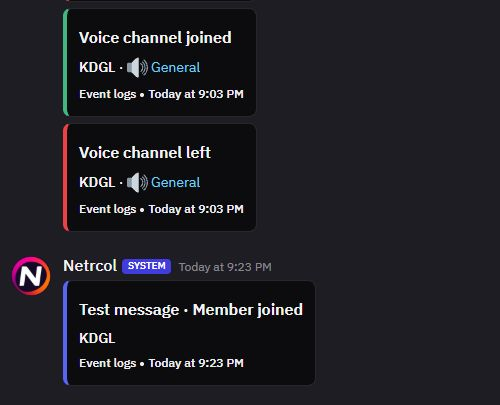

# Netrcol system identity

Built-in automation notifications, event logs, and test logs use **Netrcol** with Fluxer's **SYSTEM** badge. They retain the virtual system account ID `0`; no extra bot or database user is created.

The API user repository, Rust user service, and message service return the same identity. New deliveries, message history, and profile queries therefore agree. Existing system messages display the name and logo after a reload without changing their content or message IDs.

## Logo

The bundled logo is a 512 × 512 JPEG at [fluxer_app/src/media/images/netrcol-system-logo.jpg](../../fluxer_app/src/media/images/netrcol-system-logo.jpg), derived from the [original supplied image](https://encrypted-tbn0.gstatic.com/images?q=tbn:ANd9GcThStYRIWD_qpPDzkeDpiTvS8Y04jEJ_ZK31JEM7M_Tfw&s=10).

Chat, system profiles, notification avatars, and the avatar-loading fallback use the packaged asset. Displaying it does not request the external image server. Other users' and webhooks' avatars are unchanged.

## Build and verification

`Start-Local.ps1 -Build` builds the customized web, API/worker, gateway, user, and message images. Each Rust service and its shard share the same local image; their unit tests run during the build. Normal starts reuse ready images and preserve accounts, messages, and Docker volumes.

The October 6, 2026 identity verification passed 27 API/automation regression tests, 12 avatar tests, 103 Rust service tests, and four local preparation tests. Checks covered system-account rendering, ordinary uploaded/default avatars, webhook separation, old message history, and system profiles. Source builds, API/app type checks, strict Lingui compilation, and HTTP/JS/CSS checks also passed. These are recorded results from that verification phase.

See [local operation](LOCAL.md) and the [current verification summary](../../README.md#verification).

