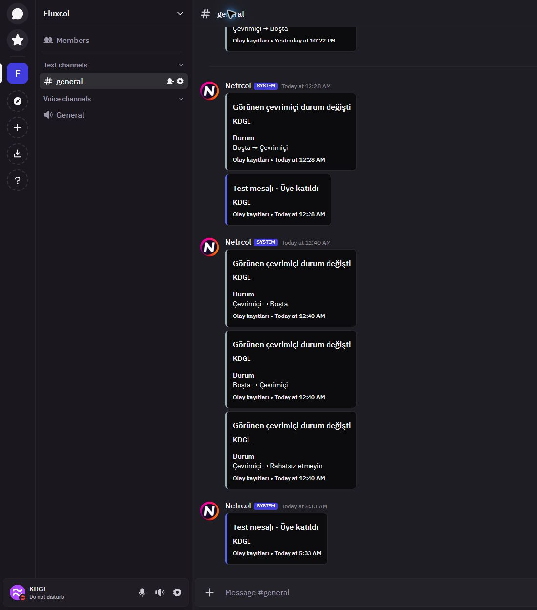

# Netrcol sistem hesabı

Yerleşik otomasyonlar, olay kayıtları, test kayıtları ve sistem bildirimleri **Netrcol** adı ve Fluxer'ın mevcut **SYSTEM** rozetiyle gönderilir. Mesajlar aynı sanal sistem hesabını (`0`) kullanır; yeni bot veya veritabanında kullanıcı kaydı oluşturulmaz.

API kullanıcı deposu, Rust kullanıcı servisi ve mesaj servisi aynı adı döndürür. Bu nedenle yeni teslimatlar, mesaj geçmişi ve profil sorguları aynı kimliği gösterir. Önceden gönderilen sistem mesajları da sayfa yenilendiğinde yeni ad ve logoyla görünür; mesajların metni ve kimliği değiştirilmez.

Logo, kullanıcının [sağladığı görselden](https://encrypted-tbn0.gstatic.com/images?q=tbn:ANd9GcThStYRIWD_qpPDzkeDpiTvS8Y04jEJ_ZK31JEM7M_Tfw&s=10) alınan 512 × 512 JPEG dosyasıdır: `fluxer_app/src/media/images/netrcol-system-logo.jpg`. Uygulama imajında paketlenir; avatar gösterilirken dış görsel sunucusuna istek gönderilmez. Sohbet, profil, avatar yükleme hatasının yedeği ve bildirim avatarları bu dosyayı kullanır. Diğer kullanıcıların ve webhook'ların avatarları değişmez.

Kaynak değişikliğinden sonra `Start-Local.ps1 -Build`, web, API/worker, gateway, kullanıcı ve mesaj servislerinin imajlarını oluşturur. Kullanıcı servisi/shard aynı `netrcol/fluxer-users:local` imajını, mesaj servisi/shard aynı `netrcol/fluxer-messages:local` imajını kullanır. Bu iki Rust servisi ortak bir yerel Dockerfile üzerinden derlenir; birim testleri derleme sırasında çalıştırılır. Normal başlatma hazır imajları kullanır; hesaplar, mesajlar ve Docker volume'ları korunur.

## Doğrulama — 6 Ekim 2026

- API ve uygulama tip kontrolleri, Biome, 34 dilin strict Lingui derlemesi ve üç çeviri kapsam kontrolü geçti.
- İzole PostgreSQL üzerinde 27 API/AutoMod/olay kaydı testi; 12 avatar testi; kullanıcı/mesaj servislerinde 103 Rust testi; dört yerel hazırlık testi geçti. Avatar testleri sistem hesabını, normal kullanıcıların varsayılan/yüklenmiş avatarlarını ve webhook ayrımını kapsar.
- Web, API/worker, kullanıcı ve mesaj servislerinin kaynak imajları oluşturulup mevcut volume'larla başlatıldı. HTTP, sağlık, giriş JS/CSS kontrolleri geçti.
- `localhost:8088 → Fluxcol → Uygulama ayarları → Olay kayıtları` üzerinden kaydedilmiş `Üye katıldı` türünün Türkçe test kaydı `#general` kanalına gönderildi. Yeni mesaj ve eski loglar **Netrcol SYSTEM** olarak göründü. Sohbet ve sistem profilindeki avatar, aynı yerel JPEG dosyasından 512 × 512 olarak yüklendi. Kayıt ayarları değiştirilmedi.

